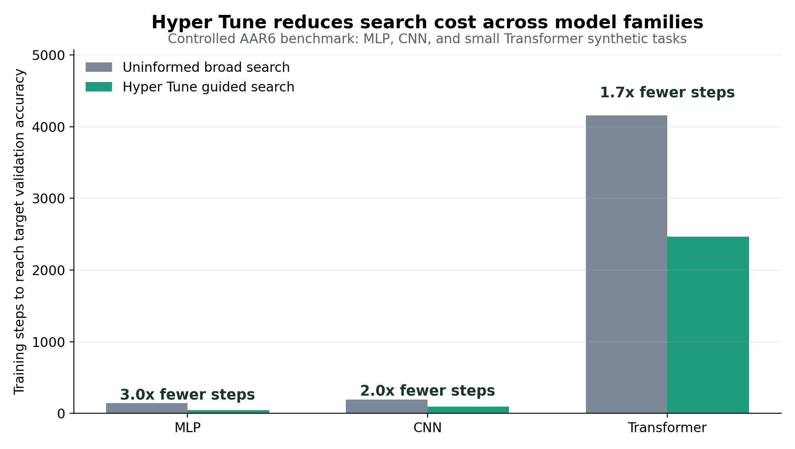

# Hyper Tune

`hyper-tune` is a Codex and Claude Code skill for finding strong training hyperparameters without burning GPU on blind sweeps. It turns tuning into a staged debugging workflow: verify the training loop first, search the highest-leverage knobs cheaply, then spend full runs only on candidates that have already shown signal.

The core idea is simple: most bad runs can be rejected before they become expensive.



## Tuning Workflow

Hyper Tune follows a cheap-to-expensive sequence:

1. **Check initial loss**
   Confirm the first loss matches the theoretical baseline. For balanced `C`-class softmax classification, initial cross-entropy should be near `log(C)`, such as `2.30` for 10 classes or `6.91` for 1000 classes. If this is wrong, debug labels, logits, loss reduction, target encoding, data normalization, and masking before training further.

2. **Overfit a tiny sample**
   Train on 5-10 examples or minibatches with regularization turned off. This is an optimization sanity check, not a final metric. If the model cannot memorize a tiny sample, do not tune scheduler or weight decay yet; inspect gradients, optimizer registration, capacity, objective mismatch, and data bugs.

3. **Find a learning rate that makes loss drop**
   Run short full-data probes, often around 100 iterations, across logarithmic LR candidates. Pick the largest LR that drops loss clearly without instability. Use optimizer-family defaults as the starting range.

4. **Run a fixed-LR coarse grid**
   Try 3-4 LRs around the best probe and a small weight-decay grid. Keep scheduler behavior simple during this phase; fixed LR makes the optimization behavior easier to read.

5. **Refine and train longer**
   Take only the best candidates into longer runs. Add cosine, step decay, warmup, or other scheduler behavior after fixed-LR behavior is understood.

6. **Read learning curves**
   Diagnose before changing knobs: large train/val gap means overfitting, low train and val with small gap means underfitting, loss still falling when LR decays means decay happened too early.

## Why This Saves GPU

Blind sweeps waste GPU because they train many configurations long enough to discover obvious failures. Hyper Tune moves failure detection earlier:

- Bad loss setup is caught at step 0 instead of after a run.
- Broken optimization is caught on a tiny sample.
- LR is screened in ~100-step probes before multi-epoch jobs.
- Scheduler and long training are deferred until fixed-LR candidates show signal.
- Architecture-specific defaults avoid searching obviously wrong regions, such as using BERT fine-tuning LR for a randomly initialized small Transformer.

The practical cost model is:

```text
GPU saved ~= (baseline_steps - hyper_tune_steps) * seconds_per_step * GPU_count
```

For multi-GPU jobs, the same step reduction multiplies across devices. A 2x reduction in failed search steps on 8 GPUs is roughly 16 GPU-hours saved for every wall-clock hour avoided.

## Benchmark Snapshot

Controlled benchmark on synthetic MLP, CNN, and small Transformer tasks. The baseline is deterministic random broad search. Hyper Tune uses architecture-informed initial points, adaptive LR probing, fixed-LR coarse search, and train-longer refinement.

| Model | Target val acc | Naive steps | Hyper Tune steps | Step reduction | Naive time | Hyper Tune time | Time speedup | Full training trials |
| --- | ---: | ---: | ---: | ---: | ---: | ---: | ---: | ---: |
| MLP | 0.97 | 144 | 48 | 3.00x | 0.75s | 0.17s | 4.48x | 2 -> 1 |
| CNN | 0.99 | 192 | 96 | 2.00x | 0.94s | 0.46s | 2.03x | 2 -> 1 |
| Small Transformer | 0.89 | 4160 | 2464 | 1.69x | 37.55s | 24.66s | 1.52x | 26 -> 11 |

This benchmark is intentionally small, but it tests the behavior the skill is meant to enforce: spend cheap probes first, avoid broad uninformed search, and reserve longer training for plausible candidates.

## Install The Skill

This repository keeps the user-facing benchmark README separate from the skill package. The actual skill package contains only the files an agent needs at runtime:

```text
hyper-tune/
├── SKILL.md
├── references/
│   └── initial-points.md
└── agents/
    └── openai.yaml
```

### Codex

From the directory that contains the `hyper-tune/` skill folder, install it as a user-level Codex skill:

```bash
mkdir -p ~/.codex/skills
cp -R hyper-tune ~/.codex/skills/hyper-tune
```

Then start a new Codex session and use `$hyper-tune`, or ask naturally for model training hyperparameter tuning, LR/WD sweep design, initial loss debugging, NaN diagnosis, overfit checks, optimizer selection, scheduler selection, or LoRA/fine-tuning starting points.

### Claude Code

Claude Code uses the same `SKILL.md` package shape, but a different user-level directory. From the directory that contains the `hyper-tune/` skill folder, run:

```bash
mkdir -p ~/.claude/skills
cp -R hyper-tune ~/.claude/skills/hyper-tune
```

Invoke it directly in Claude Code with:

```text
/hyper-tune
```

Claude Code can also auto-load it from the `description` when the request is clearly about training hyperparameters or learning-curve diagnosis. If `~/.claude/skills` did not exist when the Claude Code session started, restart Claude Code once so it watches the new top-level skills directory.

### Claude Code Project-Level Install

For a repository-specific Claude Code install, copy the same folder into:

```text
<repo>/.claude/skills/hyper-tune
```

## Suggested README Figures

Use these figures depending on space:

- `readme-search-cost.png`: best first figure. It directly shows fewer training steps to reach the same validation target.
- `comparison.png`: detailed benchmark figure with steps, wall time, and trial count side by side.
- `speedup.png`: compact secondary figure for step-reduction factors.

## When To Use It

Use `hyper-tune` when you need to:

- choose starting optimizer, LR, weight decay, scheduler, or warmup;
- plan a low-budget LR/WD sweep;
- diagnose initial loss, NaN, stagnant loss, overfitting, or underfitting;
- review an existing training config;
- choose fine-tuning or LoRA/QLoRA starting hyperparameters.

## Caveats

This benchmark demonstrates search-cost reduction against an uninformed broad search, not a universal GPU-saving guarantee. A stronger claim should include multiple seeds, harder real datasets, larger models, and stronger baselines such as ASHA/Optuna or expert-written recipes.

See `benchmark-results/report.md`, `benchmark-results/summary.csv`, and `benchmark-results/trials.csv` for the detailed run record.
