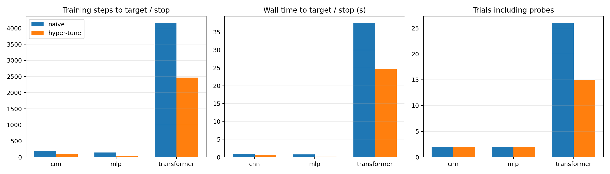
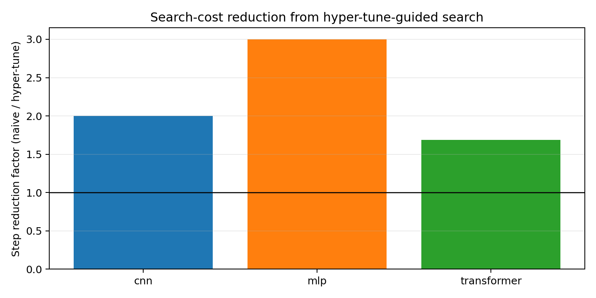

# Hyper Tune Benchmark Report

Run: `results_final_v2`

Models: MLP on synthetic tabular classification, CNN on synthetic image-pattern classification, and a small Transformer encoder on synthetic sequence classification. Naive search is deterministic random broad search. Hyper-tune search uses architecture-informed initial points, adaptive LR probe, fixed-LR coarse grid, and train-longer refinement when needed.

## Summary

| Model | Target | Naive steps | Hyper-tune steps | Step reduction | Naive time (s) | Hyper-tune time (s) | Time speedup | Naive full trials | Hyper-tune full trials |
| --- | ---: | ---: | ---: | ---: | ---: | ---: | ---: | ---: | ---: |
| mlp | 0.97 | 144 | 48 | 3.00x | 0.75 | 0.17 | 4.48x | 2 | 1 |
| cnn | 0.99 | 192 | 96 | 2.00x | 0.94 | 0.46 | 2.03x | 2 | 1 |
| transformer | 0.89 | 4160 | 2464 | 1.69x | 37.55 | 24.66 | 1.52x | 26 | 11 |

## Figures

## Notes

- The first implementation incorrectly counted tiny-overfit probes as target hits; that was fixed before this final run.
- The transformer test exposed a useful skill update: shallow transformers trained from scratch may need LR in the `1e-3` to `1e-2` range and should not reuse BERT fine-tuning LR. This was added to `hyper-tune/references/initial-points.md`.
- This is a small controlled benchmark, not a claim about universal speedup. It demonstrates that the skill can reduce search cost when the baseline is an uninformed broad search.
